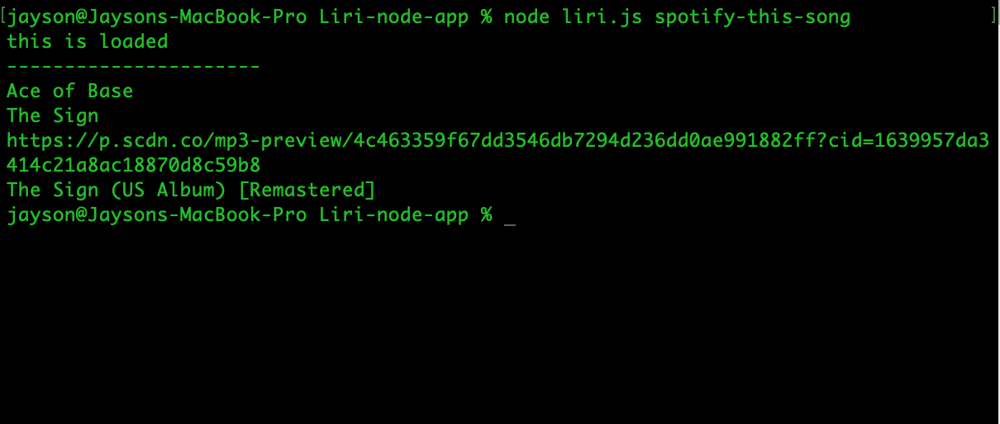
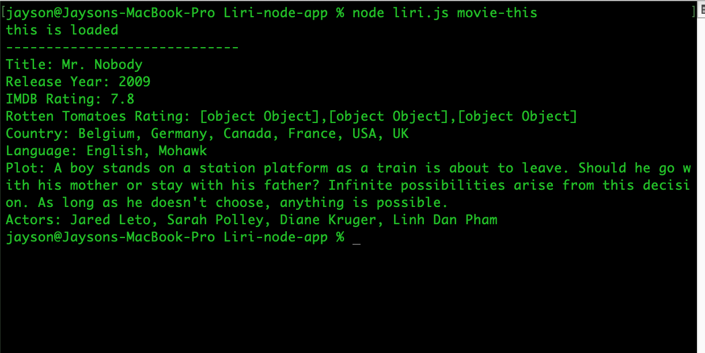
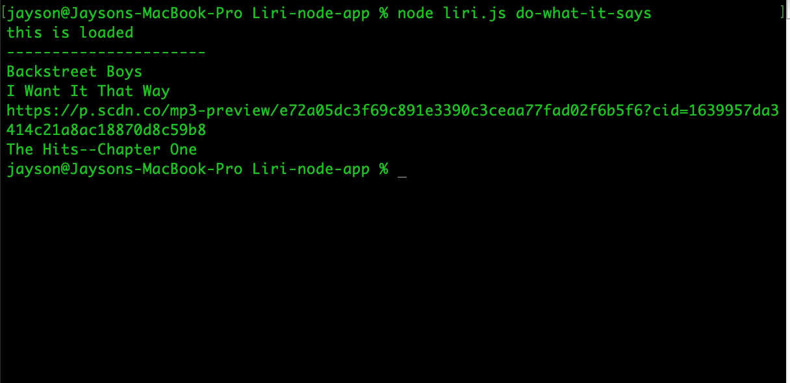
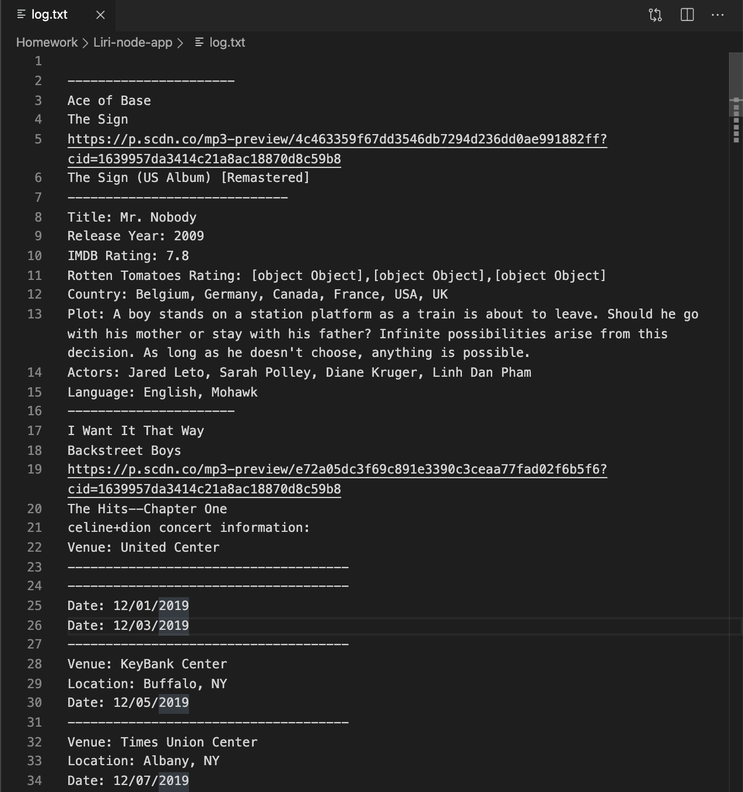

# Liri-node-app

## Assignment

Create a CLI App "LIRI" bot which stands for Language Interpretation and Recognition Interface. LIRI will be a command line node app that takes in parameters and gives you back data.

## Solution

The solution was to use "backend" technologies only.  Node.js was used along with NPM (Node Package Manager) libraries in order to accomplish the tasks. There is no front end to this application, therefore this is no html page to publish.

## Technologies
JavaScript, Node.js, Axios library, Spotify API, Moment library, File system library.

## Using LIRI


### `concert-this`

  `node liri.js concert-this <artist/band name>`

   * This will search the Bands in Town Artist Events API for an artist and show the following information about each event in the terminal and to the log.txt file:

    ```
      * Name of the venue
      * Venue location
      * Date of the Event 
    ```


### `spotify-this-song`

  `node liri.js spotify-this-song '<song name>'`

   * This will search the Spotify API for a song and show the following information about the song in the `terminal` and to the `log.txt` file:
   
    ```
      * Artist(s)
      * The song's name
      * A preview link of the song from Spotify
      * The album that the song is from
    ```



### `movie-this`

  `node liri.js movie-this '<movie name here>'`

  * This will search the OMDB API for a movie name and show the following information in the `terminal` and to the `log.txt` file:

    ```
      * Title of the movie.
      * Year the movie came out.
      * IMDB Rating of the movie.
      * Rotten Tomatoes Rating of the movie.
      * Country where the movie was produced.
      * Language of the movie.
      * Plot of the movie.
      * Actors in the movie.
    ```


### `do-what-it-says`
  `node liri.js do-what-it-says`

   * LIRI will take the text inside of `random.txt` and then use it to call one of LIRI's commands.



### 'log.txt'




   